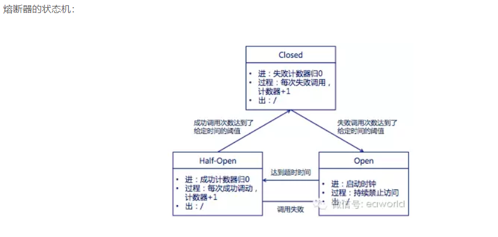

# Hystrix 示例
> Hystrix具备服务降级、服务熔断、线程隔离、请求缓存、请求合并及服务监控等强大功能。Hystrix实现了断路器模式，当某个服务发生故障时，通过断路器的监控，给调用方返回一个错误响应，而不是长时间的等待，这样就不会使得调用方由于长时间得不到响应而占用线程，从而防止故障的蔓延

# 重要参数注释
## @HystrixCommand 参数注释
- fallbackMethod：指定服务降级处理方法；
- ignoreExceptions：忽略某些异常，不发生服务降级；
- commandKey：命令名称，用于区分不同的命令；
- groupKey：分组名称，Hystrix会根据不同的分组来统计命令的告警及仪表盘信息；
- threadPoolKey：线程池名称，用于划分线程池。

## 工作原理
#### 隔离
- 1.线程隔离
> 在请求和服务之间加入了线程池，为每个依赖调用分配一个小的线程池，如果线程池已满调用将被立即拒绝，默认不采用排队，加速失败判定时间。线程数是可以被设定的
>原理：用户的请求将不再直接访问服务，而是通过线程池中的空闲线程来访问服务，如果线程池已满，则会进行降级处理，用户的请求不会被阻塞，至少可以看到一个执行结果
（例如返回友好的提示信息）而不是无休止的等待或者看到系统崩溃

- 2.信号隔离
> 信号量配置：信号量隔离也可用于限制并发访问，防止阻塞扩散，与线程隔离最大不同在于执行依赖代码的线程依然是请求线程（该线程需要通过信号申请，
>如果客户端是可信的且可以快速返回，可以使用信号隔离替换线程隔离，降低开销。信号量的大小可以动态调整，线程池大小不可以。）

#### 熔断
> 当某个目标服务调用慢或者有大量超时，此时，熔断该服务的调用，对于后续调用请求，不在继续调用目标服务，直接返回，快速释放资源。
- 熔断器 ： Circuit Breaker 
> 位于线程池之间的组件，用户请求某一服务之后，Hystrix 会先经过熔断器，此时如果熔断器的状态是打开（跳起），则说明已经熔断，这时将直接进行降级处理，不会继续
>将请求发到线程池。熔断器相当于线程池之前的一层屏障。每个熔断器默认维护10个 bucket ，每个 bucket 记录成功、超时、拒绝的次数。当有新的 bucket 被创建时，最旧的 bucket 会被抛弃。

- Closed: 熔断器关闭状态，调用失败次数累计，到了阀值（或一定比例）则启动熔断机制；
- Open : 熔断器打开状态，此时对下游的调用都内部直接返回错误，不走网络，但涉及了一个时钟选项，
默认的时钟达到了一定时间（这个时间一般设置成平均故障处理事件，即 MTR ），到了这个时间，进入半熔断状态；
- Half-Open : 半熔断状态，允许定量的服务请求，如果调用都成功（或一定比例）则任务恢复了，关闭熔断器，
否则认为还没好，又回到熔断器打开状态；

#### 结果缓存
> Hystrix 中农提供了方法级别的缓存，通过重写 getCacheKey 来判断是否返回缓存的数据，getCacheKye 可以
>根据参数生成，这样同样的参数就可以用到缓存

#### 缓存清除
>  HystrixRequestCache.getInstance(GETTER_KEY, HystrixConcurrencyStrategyDefault.getInstance()).clear(name); 清除 指定 name 的缓存

####  合并请求 HystrixCollapser
> 支持将多个请求合并为一个请求，节省网络开销

